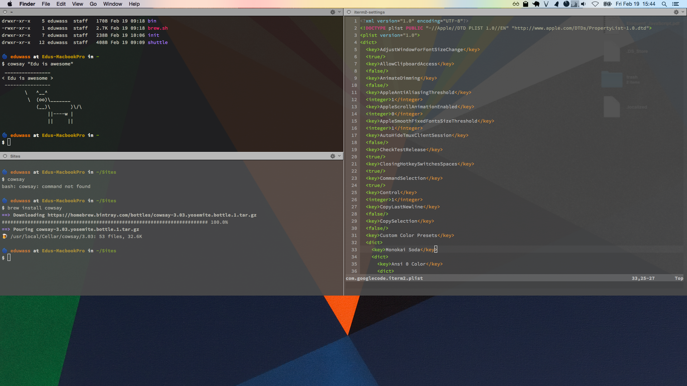
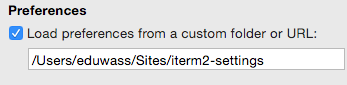

# Edu Wass' iTerm2 settings (guake-like)

Preview of iTerm2 settings in conjunction with my [dotfiles](https://github.com/eduwass/dotfiles)

## Setup
**Warning:** If you plan on customising these settings and make them your own, I strongly recommend you create your custom fork of this repository before you procede to setup.

1. Install [iTerm2](https://www.iterm2.com/)
2. In `iTerm > Preferences` activate `Load preferences from custom folder...` and point to a folder

2. Clone this repo into that folder (overwrite)
3. Restart iTerm2

## Usage
### Basic Hotkeys
* Toggle console: <kbd>CMD</kbd> + <kbd>º</kbd>
* New Tab: <kbd>CMD</kbd> + <kbd>T</kbd>
* Split pane horizontally: <kbd>CMD</kbd> + <kbd>D</kbd>
* Split pane vertically: <kbd>CMD</kbd> + <kbd>SHIFT</kbd> + <kbd>D</kbd>

### Backup
In `iTerm > Preferences` click on `Save Settings to Folder` 

Push to repo to save new settings to Github

